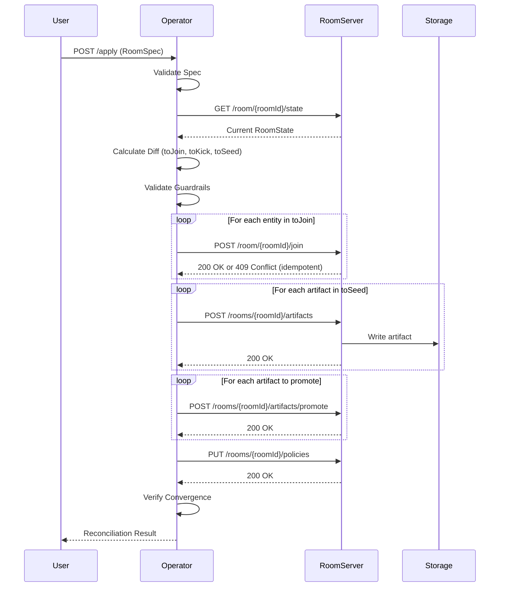

# RoomOperator-RoomServer Integration Guide

## Overview

This document describes the integration between **RoomOperator** (external reconciliation controller) and **RoomServer** (SignalR/REST room management service). The RoomOperator acts as an orchestrator that reads declarative specs and reconciles room state through idempotent API calls to RoomServer.

## Architecture Diagram

```
┌─────────────────────────────────────────────────────────────────┐
│                         RoomOperator                             │
│                                                                  │
│  ┌──────────────┐    ┌──────────────┐    ┌──────────────────┐  │
│  │  HTTP API    │    │ Reconcile    │    │  Client Layer    │  │
│  │              │───▶│  Service     │───▶│                  │  │
│  │ POST /apply  │    │              │    │ SignalRClient    │  │
│  │ GET /status  │    │ DiffEngine   │    │ ArtifactsClient  │  │
│  │ GET /health  │    │ Guardrails   │    │ PoliciesClient   │  │
│  │ GET /metrics │    │ RetryPolicy  │    │ McpClient        │  │
│  │ GET /audit   │    │ AuditLog     │    │                  │  │
│  └──────────────┘    └──────────────┘    └──────────────────┘  │
│                                                   │              │
└───────────────────────────────────────────────────┼──────────────┘
                                                    │
                    HTTP/REST + SignalR             │
                                                    │
┌───────────────────────────────────────────────────▼──────────────┐
│                         RoomServer                                │
│                                                                   │
│  ┌──────────────┐    ┌──────────────┐    ┌──────────────────┐  │
│  │  SignalR Hub │    │  REST API    │    │  Services        │  │
│  │              │    │              │    │                  │  │
│  │ Join()       │    │ /rooms/...   │    │ SessionStore     │  │
│  │ Kick()       │    │ /artifacts   │    │ ArtifactStore    │  │
│  │ SendMessage()│    │ /policies    │    │ PolicyEngine     │  │
│  │              │    │ /resources   │    │ McpRegistry      │  │
│  └──────────────┘    └──────────────┘    └──────────────────┘  │
│                                                                   │
└───────────────────────────────────────────────────────────────────┘
```

## Communication Flow

### 1. Reconciliation Lifecycle



### 2. Entity Join/Kick Flow

```
JOIN ENTITY:
1. Operator → POST /room/{roomId}/join
   Body: {
     roomId, entityId, kind, displayName,
     visibility, ownerUserId, capabilities, policy
   }
2. RoomServer validates entity spec
3. RoomServer adds to SessionStore
4. RoomServer publishes ENTITY.JOIN event
5. RoomServer returns entity list
6. Operator handles 409 Conflict as success (idempotent)

KICK ENTITY:
1. Operator → DELETE /room/{roomId}/entities/{entityId}
2. RoomServer removes from SessionStore
3. RoomServer publishes ENTITY.LEAVE event
4. RoomServer returns 200 OK
5. Operator handles 404 Not Found as success (idempotent)
```

### 3. Artifact Seeding Flow

```
SEED ARTIFACT:
1. Operator reads seed file from local filesystem
2. Operator calculates fingerprint: SHA256(name|type|workspace|tags|content)
3. Operator → GET /room/{roomId}/artifacts/{name}/hash
4. RoomServer returns current hash or 404
5. If hashes match → SKIP (idempotent)
6. If different or missing:
   Operator → POST /rooms/{roomId}/artifacts
   Headers: Content-Type: multipart/form-data
   Body:
     - spec: JSON (name, type, workspace, tags)
     - data: binary file content
7. RoomServer writes to ArtifactStore
8. RoomServer publishes ARTIFACT.CREATED event
9. RoomServer returns 200 OK

PROMOTE ARTIFACT:
1. Operator → POST /rooms/{roomId}/artifacts/promote
   Body: { name: "artifact-name" }
2. RoomServer updates artifact status
3. RoomServer publishes ARTIFACT.PROMOTED event
4. RoomServer returns 200 OK
```

### 4. Policies Update Flow

```
UPDATE POLICIES:
1. Operator → PUT /rooms/{roomId}/policies
   Body: {
     dmVisibilityDefault: "team",
     allowResourceCreation: false,
     maxArtifactsPerEntity: 100
   }
2. RoomServer validates policy structure
3. RoomServer updates room context
4. RoomServer publishes POLICIES.UPDATED event
5. RoomServer returns 200 OK
```

## API Reference

### RoomServer REST Endpoints (Used by Operator)

#### Entity Management

| Method | Endpoint | Purpose | Request Body | Response |
|--------|----------|---------|--------------|----------|
| POST | `/room/{roomId}/join` | Join entity to room | EntitySpec JSON | EntitySpec[] |
| DELETE | `/room/{roomId}/entities/{entityId}` | Kick entity from room | - | 200 OK |
| GET | `/room/{roomId}/state` | Get current room state | - | RoomState JSON |

**EntitySpec Structure:**
```json
{
  "roomId": "room-test-01",
  "entityId": "E-agent-1",
  "kind": "agent",
  "displayName": "Test Agent",
  "visibility": "team",
  "ownerUserId": null,
  "capabilities": ["read_artifacts", "execute_commands"],
  "policy": {
    "allow_commands_from": "orchestrator",
    "sandbox_mode": true,
    "env_whitelist": [],
    "scopes": []
  }
}
```

#### Artifact Management

| Method | Endpoint | Purpose | Request Body | Response |
|--------|----------|---------|--------------|----------|
| POST | `/rooms/{roomId}/artifacts` | Write room artifact | multipart/form-data | 200 OK |
| POST | `/rooms/{roomId}/entities/{entityId}/artifacts` | Write entity artifact | multipart/form-data | 200 OK |
| GET | `/rooms/{roomId}/artifacts/{name}` | Read artifact | - | Artifact data |
| GET | `/rooms/{roomId}/artifacts/{name}/hash` | Get artifact hash | - | { "hash": "..." } |
| GET | `/rooms/{roomId}/artifacts` | List room artifacts | - | Artifact[] |
| POST | `/rooms/{roomId}/artifacts/promote` | Promote artifact | { "name": "..." } | 200 OK |
| DELETE | `/rooms/{roomId}/artifacts/{name}` | Delete artifact | - | 200 OK |

**Artifact Upload (multipart/form-data):**
```
spec: {
  "name": "document-1",
  "type": "document",
  "workspace": "shared",
  "tags": ["planning", "research"]
}
data: <binary file content>
```

#### Policies Management

| Method | Endpoint | Purpose | Request Body | Response |
|--------|----------|---------|--------------|----------|
| PUT | `/rooms/{roomId}/policies` | Update room policies | PolicySpec JSON | 200 OK |
| GET | `/rooms/{roomId}/policies` | Get room policies | - | PolicySpec JSON |

**PolicySpec Structure:**
```json
{
  "dmVisibilityDefault": "team",
  "allowResourceCreation": false,
  "maxArtifactsPerEntity": 100
}
```

### RoomOperator HTTP API

#### Apply Spec

**POST /apply**

Apply a RoomSpec to reconcile room state.

**Headers:**
- `X-Dry-Run: true` - Validate without applying changes
- `X-Confirm: true` - Required when change threshold exceeded

**Request:**
```json
{
  "spec": {
    "apiVersion": "v1",
    "kind": "RoomSpec",
    "metadata": {
      "name": "test-room",
      "version": 1
    },
    "spec": {
      "roomId": "room-test-01",
      "entities": [...],
      "artifacts": [...],
      "policies": {...}
    }
  }
}
```

**Response (200 OK):**
```json
{
  "success": true,
  "partialSuccess": false,
  "correlationId": "550e8400-e29b-41d4-a716-446655440000",
  "phase": "VERIFY",
  "diff": {
    "toJoin": ["E-agent-1"],
    "toKick": [],
    "toSeed": ["artifact-1"],
    "toPromote": [],
    "blocked": []
  },
  "warnings": [],
  "duration": 1.23
}
```

#### Status

**GET /status**

Get operator status and active reconciliations.

**Response:**
```json
{
  "version": "1.0.0",
  "health": "Healthy",
  "rooms": [
    {
      "roomId": "room-test-01",
      "isReconciling": false,
      "lastReconcile": "2025-10-19T02:30:00Z",
      "pendingDiff": null,
      "blocked": [],
      "cyclesSinceConverged": 0
    }
  ],
  "queuedRequests": 0,
  "timestamp": "2025-10-19T02:35:00Z"
}
```

## Message Formats

### RoomState Response

```json
{
  "roomId": "room-test-01",
  "status": "active",
  "entities": [
    {
      "id": "E-agent-1",
      "kind": "agent",
      "displayName": "Test Agent",
      "visibility": "team",
      "capabilities": ["read_artifacts"],
      "policy": {
        "allow_commands_from": "orchestrator",
        "sandbox_mode": true
      }
    }
  ],
  "artifacts": [
    {
      "name": "document-1",
      "type": "document",
      "workspace": "shared",
      "tags": ["planning"],
      "hash": "abc123...",
      "size": 1024,
      "createdAt": "2025-10-19T01:00:00Z"
    }
  ],
  "policies": {
    "dmVisibilityDefault": "team",
    "allowResourceCreation": false,
    "maxArtifactsPerEntity": 100
  }
}
```

### SignalR Hub Events (Broadcast)

RoomServer publishes events via SignalR that clients can subscribe to:

| Event | Payload | Description |
|-------|---------|-------------|
| `ENTITY.JOIN` | `{ entityId }` | Entity joined room |
| `ENTITY.LEAVE` | `{ entityId }` | Entity left room |
| `ARTIFACT.CREATED` | `{ name, workspace }` | Artifact created |
| `ARTIFACT.PROMOTED` | `{ name }` | Artifact promoted |
| `ARTIFACT.DELETED` | `{ name }` | Artifact deleted |
| `POLICIES.UPDATED` | `{ policies }` | Policies changed |
| `ROOM.STATE` | `{ state }` | Full state update |

## Error Handling

### HTTP Status Codes

| Code | Meaning | Operator Action |
|------|---------|-----------------|
| 200 | Success | Continue to next operation |
| 400 | Bad Request | Log error, mark as failed, continue with partial success |
| 401 | Unauthorized | Abort reconciliation, check auth token |
| 403 | Forbidden | Log error, mark as failed, check permissions |
| 404 | Not Found | Consider as success for DELETE operations (idempotent) |
| 409 | Conflict | Consider as success for JOIN operations (entity exists) |
| 429 | Rate Limited | Retry with exponential backoff |
| 500 | Server Error | Retry with exponential backoff |
| 503 | Service Unavailable | Retry with exponential backoff |

### Retry Policy

**Configuration:**
```json
{
  "Operator": {
    "Retry": {
      "MaxAttempts": 3,
      "InitialDelayMs": 100,
      "MaxDelayMs": 5000,
      "JitterFactor": 0.2
    }
  }
}
```

**Algorithm:**
```
delay = min(InitialDelayMs * 2^(attempt-1), MaxDelayMs)
jitter = delay * JitterFactor * random()
actualDelay = delay + jitter
```

### Partial Success Handling

If some operations fail during reconciliation:
1. Operator continues with remaining operations
2. Response marked as `partialSuccess: true`
3. Failed operations logged with details
4. Next reconciliation cycle retries failed items
5. Convergence tracking detects stuck operations

## Idempotency Guarantees

### Entity Operations

**JOIN (POST /room/{roomId}/join):**
- Returns 409 Conflict if entity already exists
- Operator treats 409 as success
- Result: Can be called multiple times safely

**KICK (DELETE /room/{roomId}/entities/{entityId}):**
- Returns 404 Not Found if entity doesn't exist
- Operator treats 404 as success
- Result: Can be called multiple times safely

### Artifact Operations

**SEED (POST /rooms/{roomId}/artifacts):**
- Operator calculates fingerprint before upload
- Fetches current hash from server
- Only uploads if fingerprint differs
- Result: No redundant writes

**PROMOTE (POST /rooms/{roomId}/artifacts/promote):**
- Server tracks promotion status
- Duplicate promotes have no effect
- Result: Can be called multiple times safely

**DELETE (DELETE /rooms/{roomId}/artifacts/{name}):**
- Returns 404 Not Found if artifact doesn't exist
- Operator treats 404 as success
- Result: Can be called multiple times safely

### Policies Operations

**UPDATE (PUT /rooms/{roomId}/policies):**
- Server compares new policies with current
- Only updates if different
- Result: Idempotent by nature of PUT

## Guardrails and Safety

### Change Thresholds

**Configuration:**
```json
{
  "Guardrails": {
    "MaxEntitiesKickPerCycle": 5,
    "MaxArtifactsDeletePerCycle": 10,
    "ChangeThreshold": 0.5,
    "RequireConfirmHeader": true
  }
}
```

**Change Ratio Calculation:**
```
changeRatio = (entitiesToKick + artifactsToDelete) / (currentEntities + currentArtifacts)
if (changeRatio > ChangeThreshold && !X-Confirm header) {
  return error("GUARDRAILS_EXCEEDED")
}
```

**Example:**
- Current: 10 entities, 20 artifacts
- To Remove: 6 entities, 5 artifacts
- Change Ratio: (6 + 5) / (10 + 20) = 0.367 (36.7%)
- Result: **Allowed without confirmation**

- Current: 10 entities
- To Remove: 8 entities
- Change Ratio: 8 / 10 = 0.8 (80%)
- Result: **Requires X-Confirm:true header**

## Error Scenarios and Recovery

### Scenario 1: RoomServer Unavailable

**Detection:**
- HTTP connection timeout
- Connection refused errors

**Operator Response:**
1. Log error with correlation ID
2. Mark reconciliation as failed
3. Retry after configured interval (exponential backoff)
4. Emit metrics: `room_operator_reconcile_failures_total`
5. Update status: `health: "Degraded"`

**Recovery:**
- Automatic retry on next reconciliation cycle
- No manual intervention required

### Scenario 2: Authentication Failure

**Detection:**
- HTTP 401 Unauthorized
- HTTP 403 Forbidden with scope errors

**Operator Response:**
1. Log error with token info (redacted)
2. Abort reconciliation immediately
3. Update status: `health: "Unhealthy"`
4. Emit alert-level logs

**Recovery:**
- Manual: Update `ROOM_AUTH_TOKEN` environment variable
- Restart operator or wait for token refresh

### Scenario 3: Malformed Spec

**Detection:**
- Validation errors during spec parsing
- Schema validation failures

**Operator Response:**
1. Return 400 Bad Request to client
2. Log validation errors with details
3. Do NOT modify room state
4. Audit log records failed attempt

**Recovery:**
- Client fixes RoomSpec
- Resubmit to /apply endpoint

### Scenario 4: Partial Network Failure

**Detection:**
- Some operations succeed, others timeout
- Response: `partialSuccess: true`

**Operator Response:**
1. Mark succeeded operations in audit log
2. Track failed operations in next diff
3. Continue reconciliation (don't abort)
4. Retry failed operations in next cycle

**Recovery:**
- Automatic retry in next cycle
- Eventually converges to desired state

### Scenario 5: Guardrails Triggered

**Detection:**
- Change ratio exceeds threshold
- No `X-Confirm:true` header present

**Operator Response:**
1. Return 412 Precondition Failed
2. Log change details and ratio
3. Do NOT modify room state
4. Provide clear error message to client

**Recovery:**
- Client reviews changes
- Resubmit with `X-Confirm:true` header

## Testing Strategies

### Integration Testing

**Test Categories:**
1. **Happy Path**: Join entities → Seed artifacts → Update policies
2. **Idempotency**: Repeat operations, verify no side effects
3. **Error Handling**: Simulate failures, verify recovery
4. **Concurrency**: Multiple operators, verify consistency
5. **Performance**: Measure reconciliation time under load

### Smoke Tests

**Minimal Validation:**
```bash
# 1. Start RoomServer
cd server-dotnet/src/RoomServer
dotnet run

# 2. Start RoomOperator
cd server-dotnet/operator
export ROOM_AUTH_TOKEN="test-token"
dotnet run

# 3. Apply test spec
curl -X POST http://localhost:8080/apply \
  -H "Content-Type: application/json" \
  -d @specs/test-room.json

# 4. Verify status
curl http://localhost:8080/status

# 5. Check RoomServer state
curl http://localhost:5000/room/room-test-01/state
```

### Load Testing

**Stress Scenarios:**
- 100 entities joined in single reconciliation
- 500 artifacts seeded concurrently
- Reconciliation cycle every 100ms
- Multiple rooms reconciled in parallel

## Best Practices

### 1. Always Use Dry Run First

```bash
curl -X POST http://localhost:8080/apply \
  -H "X-Dry-Run: true" \
  -H "Content-Type: application/json" \
  -d @spec.json
```

### 2. Monitor Metrics

**Key Metrics:**
- `room_operator_reconcile_duration_seconds`: Latency
- `room_operator_reconcile_failures_total`: Error rate
- `room_operator_queued_requests`: Backlog

### 3. Use Correlation IDs

All operations include correlation IDs for tracing:
```
[2025-10-19T02:30:00Z] [550e8400] ENTITY.JOIN E-agent-1
[2025-10-19T02:30:01Z] [550e8400] ARTIFACT.SEED document-1
[2025-10-19T02:30:02Z] [550e8400] RECONCILE.SUCCESS
```

### 4. Review Audit Logs

Query audit logs regularly:
```bash
curl http://localhost:8080/audit?count=100
```

### 5. Version Control Specs

- Keep RoomSpecs in Git
- Use semantic versioning
- Tag releases
- Review diffs before applying

## Troubleshooting Guide

### Problem: "Connection refused" errors

**Symptoms:**
```
Failed to connect to http://localhost:5000
System.Net.Http.HttpRequestException
```

**Solution:**
1. Verify RoomServer is running: `curl http://localhost:5000/health`
2. Check `RoomServer:BaseUrl` in appsettings.json
3. Verify network connectivity
4. Check firewall rules

### Problem: Authentication failures

**Symptoms:**
```
HTTP 401 Unauthorized
"error": "INVALID_TOKEN"
```

**Solution:**
1. Verify token: `echo $ROOM_AUTH_TOKEN`
2. Check token expiration
3. Validate required scopes in appsettings.json
4. Regenerate token if expired

### Problem: Artifacts not seeding

**Symptoms:**
```
"warnings": ["artifact-1 seed failed: file not found"]
```

**Solution:**
1. Verify `seedFrom` path in RoomSpec
2. Check file exists: `ls -la seeds/`
3. Verify file permissions
4. Use absolute paths or relative to operator directory

### Problem: Reconciliation stuck

**Symptoms:**
```
"cyclesSinceConverged": 25
"isReconciling": true
```

**Solution:**
1. Check operator logs for errors
2. Verify RoomServer is responsive
3. Check for circular dependencies in artifacts
4. Restart operator if needed

### Problem: Guardrails blocking changes

**Symptoms:**
```
HTTP 412 Precondition Failed
"error": "GUARDRAILS_EXCEEDED"
```

**Solution:**
1. Review change ratio in response
2. Add `X-Confirm:true` header if intended
3. Reduce scope of changes
4. Adjust guardrails in appsettings.json

## Configuration Reference

### RoomOperator Configuration

**appsettings.json:**
```json
{
  "RoomServer": {
    "BaseUrl": "http://localhost:5000",
    "HubPath": "/hub"
  },
  "Auth": {
    "TokenType": "Bearer",
    "Token": "${ROOM_AUTH_TOKEN}",
    "RequiredScopes": [
      "room:entities:write",
      "room:artifacts:write",
      "room:policies:write"
    ],
    "ValidateScopes": true
  },
  "Operator": {
    "Version": "1.0.0",
    "Features": {
      "Resources": false
    },
    "Reconciliation": {
      "IntervalSeconds": 2,
      "ParallelRooms": 1,
      "RateLimitPerSecond": 8,
      "StateConsistency": {
        "Mode": "active",
        "StaleTolerance": "5s",
        "ReadBeforeApply": true
      },
      "Guardrails": {
        "MaxEntitiesKickPerCycle": 5,
        "MaxArtifactsDeletePerCycle": 10,
        "ChangeThreshold": 0.5,
        "RequireConfirmHeader": true
      }
    },
    "Retry": {
      "MaxAttempts": 3,
      "InitialDelayMs": 100,
      "MaxDelayMs": 5000,
      "JitterFactor": 0.2
    }
  },
  "HttpApi": {
    "Port": 8080
  }
}
```

### RoomServer Configuration

**appsettings.json:**
```json
{
  "Logging": {
    "LogLevel": {
      "Default": "Information"
    }
  },
  "McpServers": [],
  "McpDefaults": {
    "rateLimit": {
      "perMinute": 60
    },
    "scopes": ["net:*"],
    "allowedEntities": "public"
  }
}
```

## Performance Considerations

### Latency Expectations

| Operation | Expected Latency | Notes |
|-----------|------------------|-------|
| GET /room/{roomId}/state | 10-50ms | Depends on entity count |
| POST /room/{roomId}/join | 20-100ms | Per entity |
| POST /rooms/{roomId}/artifacts | 100-500ms | Depends on file size |
| PUT /rooms/{roomId}/policies | 10-30ms | Lightweight |
| Full reconciliation cycle | 500ms-5s | Depends on spec size |

### Optimization Tips

1. **Batch Operations**: Group related changes in single spec
2. **Reduce Seed Files**: Use compressed formats, link to external storage
3. **Adjust Intervals**: Increase `IntervalSeconds` for large rooms
4. **Enable Caching**: Use `StateConsistency.StaleTolerance`
5. **Parallel Processing**: Set `ParallelRooms > 1` for multiple rooms

## Security Considerations

### Authentication

- Use Bearer tokens with appropriate scopes
- Rotate tokens regularly
- Store tokens in environment variables, not in config files
- Validate token expiration

### Authorization

- RoomOperator requires these scopes:
  - `room:entities:write`
  - `room:artifacts:write`
  - `room:policies:write`
  - `room:resources:read` (if MCP enabled)

### Data Protection

- Artifacts are stored server-side only
- No credentials in RoomSpecs
- Audit logs don't contain sensitive data
- Use HTTPS in production

## Future Enhancements

- [ ] WebSocket-based state subscription
- [ ] Differential state updates (patches)
- [ ] Webhook notifications on reconciliation events
- [ ] GitOps integration (watch Git repos for spec changes)
- [ ] Multi-room parallel reconciliation
- [ ] Advanced RBAC with fine-grained permissions
- [ ] Automatic rollback on critical failures
- [ ] Spec versioning and history API

## Support and Resources

- **Documentation**: `/docs/room-operator.md`
- **GitHub Issues**: https://github.com/invictvs-k/metacore-stack/issues
- **Test Client**: `/server-dotnet/operator/test-client/`
- **Example Specs**: `/server-dotnet/operator/specs/`

---

**Last Updated**: 2025-10-19  
**Version**: 1.0.0
